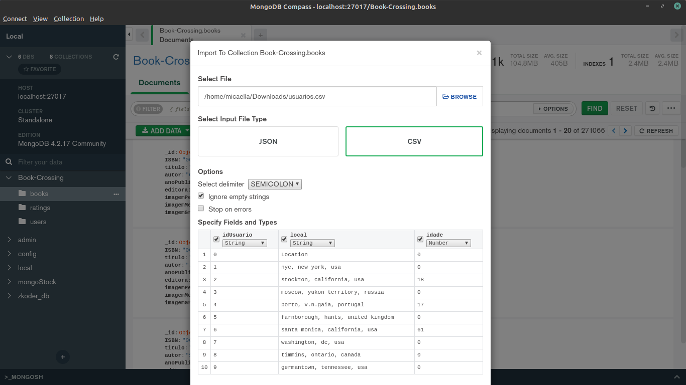
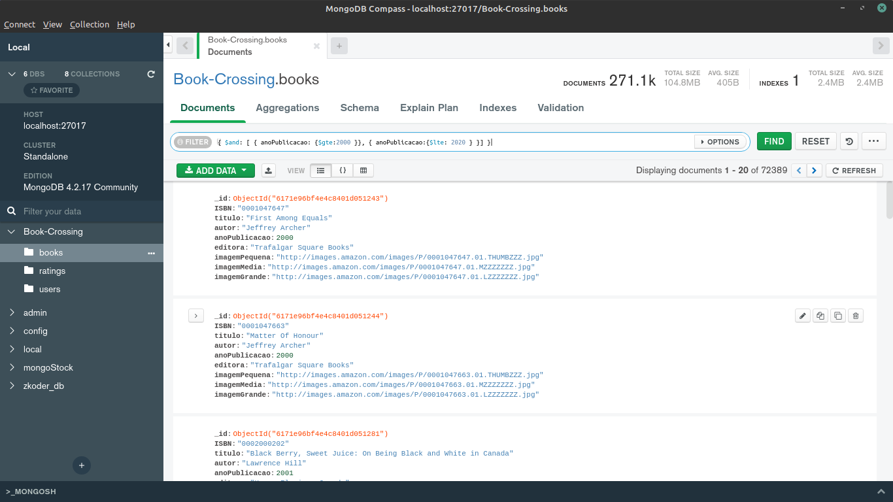
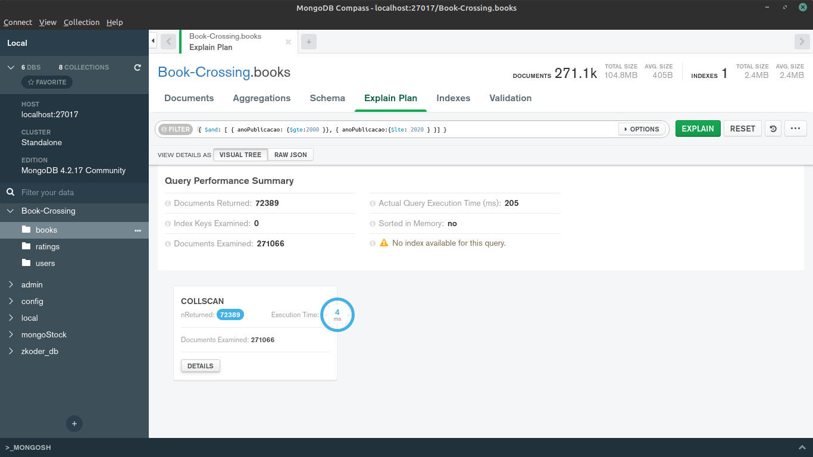
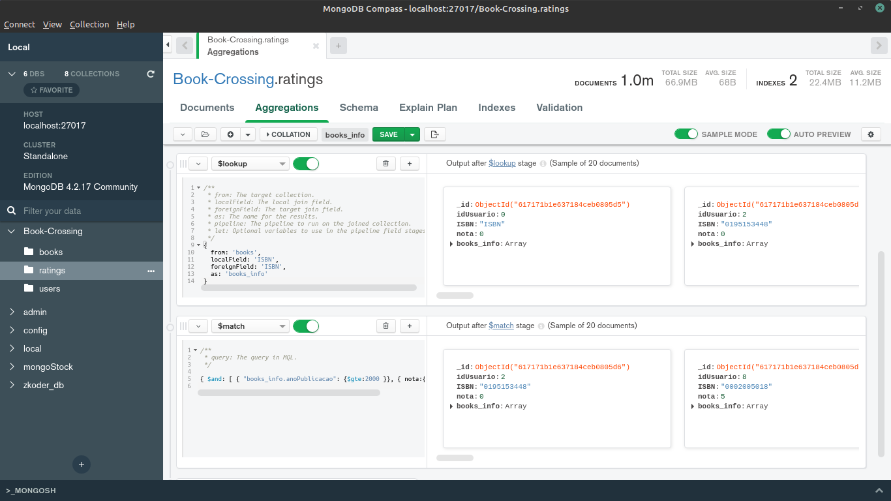

# Bancos de Dados Semi Estruturados - Grupo I1

## Integrantes
* Hérya Rodrigues Alcantara - 18/0018574
* Micaella Lorraine Gouveia de Lima - 17/0111288

## Projeto
Nosso projeto tem como tema Bancos de Dados Semi Estruturados e para a parte prática foi feita uma importação do banco de dados escolhido para o banco MongoDB.

A base de dados Book-Crossing foi a escolhida para ser utilizada no trabalho prático. Os dados apresentados são sobre usuários, livros e as avaliações de livros realizadas pelos usuários. A base foi inicialmente escolhida pela estudante Hérya. A equipe escolheu esta base pois, ao ser adaptada ao modelo relacional, sua estrutura resultante foi simples, com apenas três entidades e dois relacionamentos. No entanto, apesar da estrutura simples, a base apresenta uma quantidade considerável de dados interessantes para serem utilizados na atividade prática. A base de dados Book-Crossing está disponível no endereço virtual **<https://www.kaggle.com/ruchi798/bookcrossing-dataset>**.

## Base de Dados (MySQL) - POPULA
Para acessar o Script de Popula da base em MySQL: **<https://drive.google.com/file/d/10_NIs5IBEx1CbR9UZMBxucT2d5qy1Ww0/view?usp=sharing>**

## Importação
Para a importação da base de dados foi utilizada a interface do MongoDB, o MongoDB Compass. Foi criada um database com nome Book-Crossing, e depois foram criadas 3 collections, sendo elas Books, Ratings e Users. A importação é feita pela interface de forma bem intuitiva como na imagem abaixo:



## Consultas
Para a parte prática fizemos duas consultas na base de dados.

1. **Livros publicados entre os anos 2000 e 2020**

Nesta consulta foi preciso apenas acessar a collection de Books e filtrar seus dados utilizando a seguinte query:

```
{ $and: [ { anoPublicacao: {$gte:2000 }}, { anoPublicacao:{$lte: 2020 } }] }
```



Fizemos uma análise da velocidade de resposta do banco e obtivemos:

;

2. **Livros publicados depois dos anos 2000 com nota de avaliação menor que 5**

Nesta consulta foi preciso fazer uma agregação entre as tabelas Ratings e Books. Para isso, usando a interface do MongoDB Compass, foi preciso criar uma pipeline de agregação. Essa pipeline foi feita na collection Ratings, fazendo sua agregação com Books e depois dando o match necessário para a busca.

```
[
  {
    '$lookup': {
      'from': 'books', 
      'localField': 'ISBN', 
      'foreignField': 'ISBN', 
      'as': 'books_info'
    }
  }, {
    '$match': {
      '$and': [
        {
          'books_info.anoPublicacao': {
            '$gte': 2000
          }
        }, {
          'nota': {
            '$lte': 5
          }
        }
      ]
    }
  }
]

```



Nesta imagem é possível ver uma prévia do resultado de cada estágio da pipeline.

## Como rodar

Para rodar a base de dados é necessário possuir o MongoDB instalado e sua interface [MongoDB Compass](https://www.mongodb.com/try/download/compass).

A base de dados Book-Crossing está disponível no endereço virtual **<https://www.kaggle.com/ruchi798/bookcrossing-dataset >**. Nela pode-se baixar os arquivos em formato CSV e importar pela interface do MongoDB Compass.

## Importação Manual
Foi feita uma importação manual dessa base de dados. Ele faz a leitura do arquivo CSV, faz seu tratamento e salva no banco MongoDB. Neste repositório tem-se um exemplo dessa importação.

Para rodá-lo é necessário ter o node instalado, e adicionar algumas dependências:

```
yarn add fast-csv fs mongodb
```

Após a instalação das dependências, basta apenas rodar o comando:
```
node import.js
```
